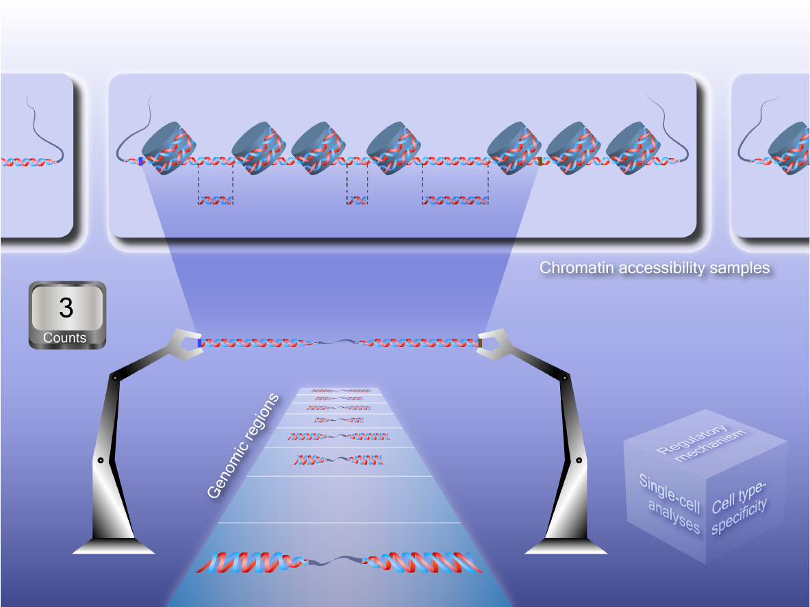

# [OpenAnnotate](http://health.tsinghua.edu.cn/openannotate/): a web server to annotate the chromatin accessibility of genomic regions


## Introduction
The construction of the OpenAnnotate backend requires great efforts and can hardly be deployed in an ordinary server or workstation. Briefly, in order to construct the OpenAnnotate backend, one needs 1) **elaborate chromatin accessibility data preprocessing** for high-frequency data read operation, 2) **sophisticated multithreaded program** tailored to the preprocessed data, and 3) **high-performance computer** to maximize the program efficiency. 

For step one, given more than 26 TB BAM and BED files containing reads and peaks, the data preprocessing includes 7 major steps to convert the 2729 chromatin accessibility samples to over 2.3 TB binary files with the tailored data structure. It costs more than a week to preprocess all the data even with 15 computing nodes in our high-performance computing cluster. For steps two and three, the multithreaded program is designed to be run on a computer with high-performance processors and ultra-high performance storage. For example, the current version of the OpenAnnotate program was deployed on a server with two Intel scalable processors (56 hyper-threads in total), 768 GB RAM, and 480 TB storage space. In addition, two 2TB Samsung 980 PRO SSDs, each of which can achieve sequential read/write speed up to 7000/5100 MB/s and random read/write speed of 1000K IOPS (queue depth 32 with 16 threads), were adopted to cache hard drives for supporting intensive reading and writing operations. It is therefore clear that **the cooperation of the hardware and the software is indispensable** in order to achieve the high performance as described in the paper, which suggests the significance and irreplaceability of our work. 

**Warning**: most ordinary servers and workstations do not have such hardware conditions, especially the ultra-high performance storage system that requires not only big capacity but also high random access efficiency. Therefore, we recommend using [the website of OpenAnnotate](http://health.tsinghua.edu.cn/openannotate/) to annotate the chromatin accessibility of genomic regions.

## Requirements
```
OpenLDAP for identity management
Slurm with partitions named 'normal'
Libraries including lz4, bzlib and lzma
GCC with versions of 4.8.5 or 5.4.0 (tested)
```

## Preprocess data for the OpenAnnotate program
Here we take human-hg19-atac as an example.

### Data preparation  
* **BAM files**: Save BAM files and the corresponding index and MD5 in /data/encode/human/aseq/**bams**/hg19/, e.g.,
```
/data/encode/human/aseq/bams/hg19/ENCFF426DGP/ENCFF426DGP.bam
/data/encode/human/aseq/bams/hg19/ENCFF426DGP/ENCFF426DGP.bam.bai
/data/encode/human/aseq/bams/hg19/ENCFF426DGP/ENCFF426DGP.md5
```
* **BED files**: Save gzip-compressed BED files and the corresponding MD5 in /data/encode/human/aseq/**peak**/hg19/ for narrow peaks and /data/encode/human/aseq/**spot**/hg19/ for broad peaks, e.g.,
```
/data/encode/human/aseq/peak/hg19/ENCFF426DGP/ENCFF426DGP.bed.gz
/data/encode/human/aseq/peak/hg19/ENCFF426DGP/ENCFF426DGP.md5
/data/encode/human/aseq/spot/hg19/ENCFF426DGP/ENCFF426DGP.bed.gz
/data/encode/human/aseq/spot/hg19/ENCFF426DGP/ENCFF426DGP.md5
```

### Preprocessing
Save the scripts in the **preprocess/** directory in /home/open/. Then
* **bams**: `cd /home/open/human/hg19/prog/data/code/aseq/bams` and then `./create_file.sh`
* **beds**: `cd /home/open/human/hg19/prog/data/code/aseq/beds` and then `./create_file.sh`
* **cnts**: `cd /home/open/human/hg19/prog/data/code/aseq/cnts` and then `./create_file.sh`
* **read**: `cd /home/open/human/hg19/prog/data/code/aseq/read`, `./update_file.sh`, and then `./create_file.sh`
* **peak**: `cd /home/open/human/hg19/prog/data/code/aseq/peak`, `./update_file.sh`, and then `./create_file.sh`
* **spot**: `cd /home/open/human/hg19/prog/data/code/aseq/spot`, `./update_file.sh`, and then `./create_file.sh`
* **bins**: `cd /home/open/human/hg19/prog/anno/code/aseq/file`, `./update_bins.sh`, and then `./create_dump.sh`

To demonstrate the usage of OpenAnnotate program, we have uploaded the processed binary data of human-hg19-atac-chrM to the **data/human/hg19/atac/file/** directory.

## Installation of OpenAnnotate program
Install OpenAnnotate from GitHub via
```
git clone git://github.com/RJiangLab/OpenAnnotate.git
cd OpenAnnotate
make
```
A directory named **tmp/gcc-x.x.x/** will be created automatically. GCC versions of 4.8.5 and 5.4.0 have been tested.

## Quick Start
Copy the executable OpenAnnotate program to the **bins/** directory and run OpenAnnotate via
```
cp tmp/gcc-5.4.0/bin/openanno bins/
./bins/openanno --species=human --assembly=hg19 --assay=atac --thread=8 \
                --input-file=./test/test.bed \
                --head-file=./test/head.txt.gz \
                --readopen=./test/readopen.txt.gz \
                --broadpeak=./test/spotopen.txt.gz \
                --narrowpeak=./test/peakopen.txt.gz \
                --foreground=./test/foreground.txt.gz
```
The annotation results will be save in the **test/** directory. 

Note that we only uploaded the processed binary data of human-hg19-atac-chrM for demonstration. It will arise errors if the input-file contains genomic regions of other chromosomes.

### Input

* **species**: Species to annotate. Possible values: 'human' for Homo sapiens, 'mouse' for Mus musculus.
* **assembly**: Assembly to use. Possible values: 'hg19' and 'hg38' for Homo sapiens, 'mm9' and 'mm10' for Mus musculus.
* **assay**: Assay to annotate. Possible values: 'dnase', 'atac', and 'atdb'.
* **thread**: Number of threads used to annotate, e.g., 8.
* **input-file**: Uncompressed or gzip-compressed BED file containing genomic regions to be annotated. The file should be separated by tabs. The first three columns and the sixth column (chromosome, starting site, terminating site and strand, respectively) are used for annotation.
* **perbasepair**: Enable the Per-base pair annotation mode.
* **replicate**: Replicate to annotate, e.g., 'ENCFF426DGP'.
* **biosample**: Biosample to annotate, e.g., 'ENCBS998NWZ'.
* **experiment**: Experiment to annotate, e.g., 'ENCSR074AHH'.
* **celltype**: Celltype to annotate, e.g., 'A549'.
* **organ**: Organ to annotate, e.g., 'Lung'.
* **system**: System to annotate, e.g., 'Respiratorysystem' for Respiratory system.

### Output

* **head-file**: Path to save the head file.
* **foreground**: Path to save the foreground read count.
* **readopen**: Path to save the raw read openness.
* **narrowpeak**: Path to save the narrow peak openness.
* **broadpeak**: Path to save the broad peak openness.

## Troubleshooting
OpenAnnotate requires libraries such as lz4, bzlib and lzma. Users might account following errors when installing
```
fatal error: lz4.h: No such file or directory
fatal error: bzlib.h: No such file or directory
fatal error: lzma.h: No such file or directory
```
This can be solved by installing the corresponding library
```
sudo apt-get install liblz4-dev
sudo apt-get install libbz2-dev
sudo apt-get install liblzma-dev
```
